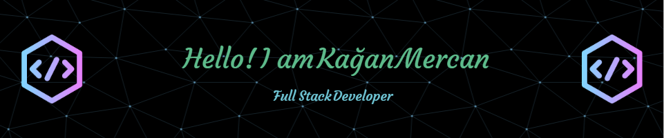

 

  

**About me**

- 👨‍💻 I'm a passionate and self-learning Full Stack developer

- 🌱 I’m currently learning **React**

- 📫 Reach me at **kaganmercan@yahoo.com**

**Connect with me:**

**Languages and Tools:**

          <a </a>         

**Stats**

|   |  |  |
| ------------- | ------------- | ------------- |
